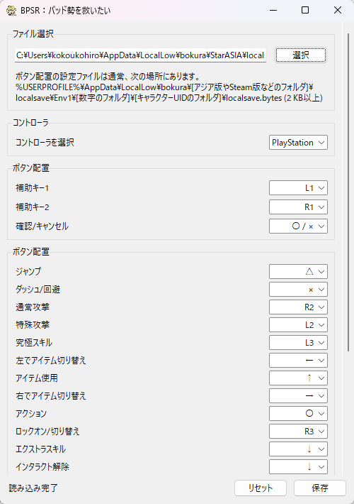

## BPSR：パッド勢を救いたい

Blue Protocol: Star Resonanceのパッド用ボタン配置を編集するための非公式ツールです。
ゲーム内の設定だけでは調整しにくいボタン割り当てを、`localsave.bytes` を直接編集することで変更できます。

### 主な機能

- パッド用ボタン配置の編集

### 注意事項

- ゲーム起動中にこのツールで `localsave.bytes` を編集しても、変更は反映されません。
- ボタン配置を編集する際は、**必ずゲームを終了した状態で** 行ってください。
- 編集前に `localsave.bytes` のバックアップを取っておくことをおすすめします。

### スクリーンショット

### 対応環境

- Windows
